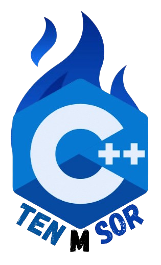

# README for MTensor : PyTorch-Like Library in C++

 

## Overview
This is a simple implementation of a Tensor-like library in C++ aimed at understanding the language and how complex objects can be implemented from scratch. The library provides basic operations at the Scalar level, a high-dimensional `Tensor` object that supports a variety of mathematical operations, gradient tracking for backpropagation, and a basic neural network module. It is primarily designed for learning purposes and is not optimized for real-world applications.

## Features
### Scalar and Tensor Operations
- **Scalar Operations:** Supports arithmetic operations (+, -, *, /) and automatic gradient tracking using a custom `Scalar` class.
- **Tensor Operations:** Built on top of Scalars, Tensor operations support broadcasting, element-wise arithmetic operations, reshaping, and various mathematical functions like `conv2d`, `transposeconv2d`, `padding2d`, `crop`, `sum`, `mean`, `exp`, `sqrt`, and `log`.

### Neural Network Components
- **Modules:**
  - `Conv2d`
  - `TransposedConv2d`
  - `MaxPooling`
- **Optimizers:** 
  - `Adam`
  - `SGD`
- **Loss Functions:**
  - `Softmax`
  - `MSE Loss`
  - `CrossEntropy`
  - `BinaryCrossEntropy`

### Gradient Tracking and Backpropagation
- A generalized backward function that computes gradients for each tensor in the computational graph. However, it uses a recursive approach with Scalar-level backward, making it slower when the number of gradients is high.

### Utility Functions
- Functions for generating random Tensors with `Rand`, `Ones`, `Zeros`, `Randn`.
- Basic reshaping and inserting operations (`view`, `insert_data`).

### Performance Considerations
- The current implementation is not optimized for performance, especially with large numbers of gradients, as the backward pass computes gradients one at a time.
- Operations are not multi-threaded, which could lead to slow performance for large models or datasets.

## Getting Started

1. **Clone the repository:**
   ```bash
   git clone <repository_url>
   ```

2. **Build the library:**
   Navigate to the root directory and compile the code using a C++ compiler (such as `g++` or `clang`).
   ```bash
   g++ -std=c++17 -o tensor_library app.cpp


3. **Run the examples:**
   The library comes with a set of example scripts demonstrating various features. Run the `app` script to see the Tensor operations in action.

4. **Customization:**
   You can modify or extend the library as needed to support additional features, optimizations, or algorithms.

## Limitations
- The library is **not optimized for production use**. Its purpose is purely for educational purposes and understanding the C++ language, object-oriented programming, and recursive patterns.
- The backward function, in particular, can be very slow for larger models due to the Scalar-based backward implementation and lack of multithreading.

## Future Improvements
- **Optimization:** The backward pass and tensor operations can be optimized for speed, including multithreading and vectorization.
- **Memory Management:** Better memory management to handle larger tensors and avoid memory bottlenecks.
- **Performance Enhancements:** Adding GPU support with CUDA or similar libraries to improve performance for large-scale tasks.

--- 

Feel free to contribute, fork, or modify the library to fit your needs. Enjoy experimenting and learning with C++!